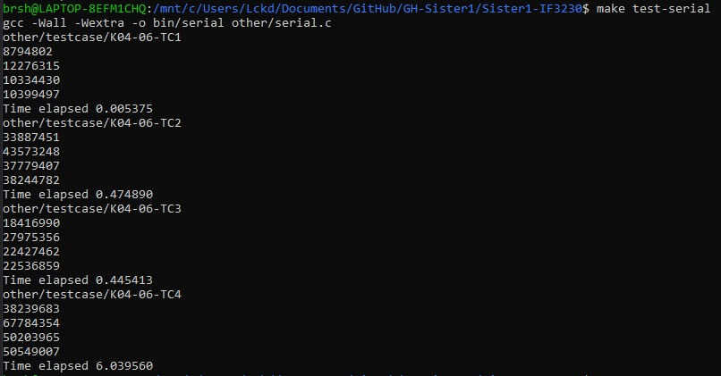
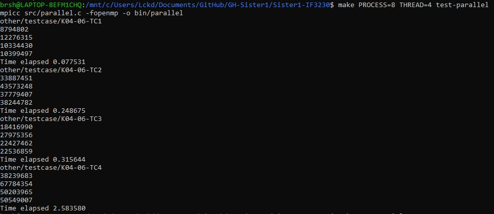
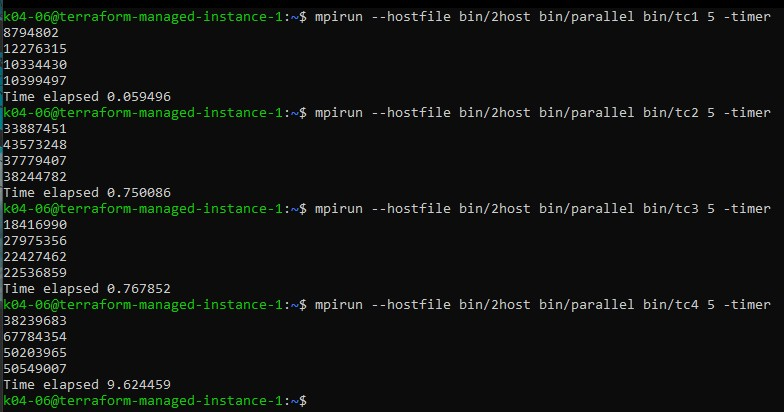
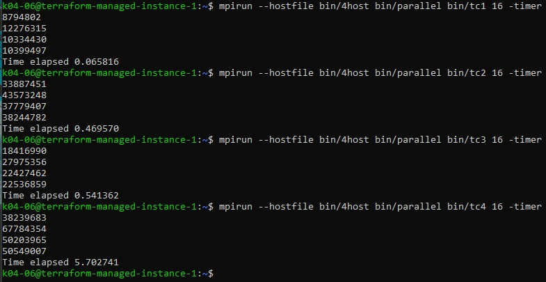

# Tugas Besar 1 - Sister
Catatan : Repository Gitlab IF merupakan mirror dari Repository private Github dengan menggunakan GitHub Action

## 1. Alur Paralelisasi Program
Inti algoritma program untuk konvolusi sama persis dengan program serial.
Seluruh fungsi non-main dan struct milik `serial.c` dipindahkan ke `serial_lib.c`.
Ide utama dari program adalah *scatter and gather*. Berikut adalah alur program

1. Proses rank 0 akan melakukan pembacaan file input dengan fungsi file yang disediakan C stdlib.
Pembacaan dimulai dari awal file hingga ukuran matriks target dan num_targets.
2. Lakukan broadcasting seluruh informasi metadata dan matriks kernel ke semua proses selain rank 0.
3. Dengan menggunakan `FILE *` dari tahap 1, lakukan penyebaran matriks sesuai dengan urutannya.
4. Proses rank selain 0 akan menerima semua matriksnya dan langsung mengeksekusi konvolusi menggunakan OpenMP.
5. Setelah proses rank selain 0 selesai memproses, hasil matriks akan dikirim ke proses rank 0.
6. Proses rank 0 menerima seluruh hasil matriks dan menampilkan hasil akhir.

## 2. Waktu Eksekusi Program
Testing dijalankan pada Ryzen 4800H (8 Cores / 16 Threads). Berikut adalah waktu eksekusi program serial dan paralel dengan
8 process dan 4 thread dijalankan pada mesin lokal

 \

## 3. Analisis Serial dan Paralel
 Setelah melakukan testing, pada umumnya tiga test case awal
tidak memiliki perbedaan yang signifikan. Namun dengan parameter `PROCESS` dan `THREAD` yang tepat program paralel dapat berjalan
lebih cepat daripada serial pada test case ke 4. Percepatan dari serial ke paralel dapat mencapai 2x lipat.

Hal itu sesuai dengan prediksi bahwa program paralel membutuhkan proses komunikasi yang menjadi overhead. Dalam ketiga test case awal,
 ukuran input matriks tidak terlalu banyak jika dibandingkan test case ke 4. Program paralel dengan `PROCESS` dan `THREAD` yang tinggi
 pada ketiga test case awal cenderung memiliki performa yang kurang bagus, bahkan dapat mencapai perbedaan 10x dibandingkan serial
 pada test case pertama. Hal tersebut disebabkan karena proses komunikasi menjadi overhead yang tidak diperlukan untuk ukuran masalah
 yang kecil.

## 4. Testing Dengan Node
Berikut adalah hasil untuk 2 node/5 thread dan 4 node/16 thread program

 \
 

Mirip dengan perbedaan serial-paralel pada proses lokal, pada test case 1 waktu yang dibutuhkan 10x lebih lama dibandingkan serial.
Namun seiring dengan ditambahnya node, kecepatan pemrosesan untuk data yang besar seperti test case 4 mengalami percepatan
dibandingkan program serial. Hasil analisis performa paralel program mirip dengan serial-paralel sebelumnya, semakin banyak data
yang diproses, semakin berkurang relevansi overhead dan semakin cepat algoritma dijalankan. Khususnya pada test case 4,
terlihat bahwa jalur komunikasi dapat mempengaruhi kecepatan eksekusi program. Program lokal yang dijalankan dengan 4 proses
jika dibandingkan dengan program yang berjalan diatas 4 node akan lebih cepat dikarenakan proses yang berkomunikasi dalam satu
sistem operasi lebih cepat secara latensi dibandingkan saluran networking.

## Referensi
1. https://docs.microsoft.com/en-us/message-passing-interface
2. https://www.codingame.com/playgrounds/349/introduction-to-mpi/mpi_comm_world-size-and-ranks
3. http://personalpages.to.infn.it/~mignone/MPI/lecture5.pdf
4. https://www.open-mpi.org/doc/v3.1/man1/
5. https://events.prace-ri.eu/event/176/contributions/59/attachments/170/326/Advanced_MPI_II.pdf
6. https://mpitutorial.com/tutorials/mpi-send-and-receive/
